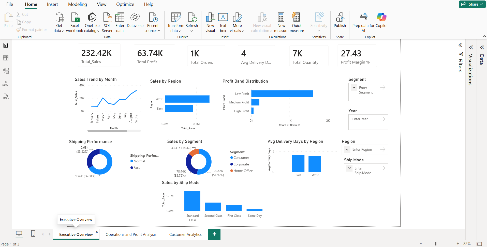
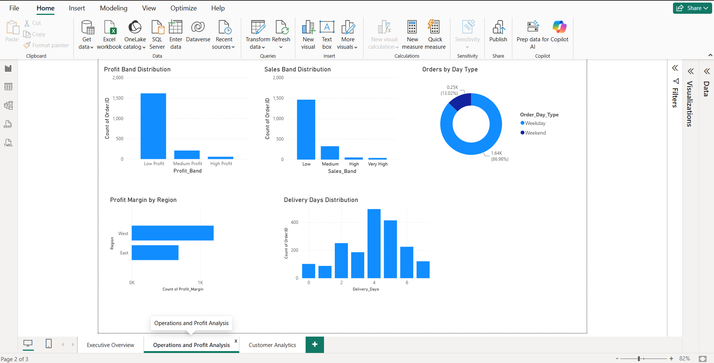
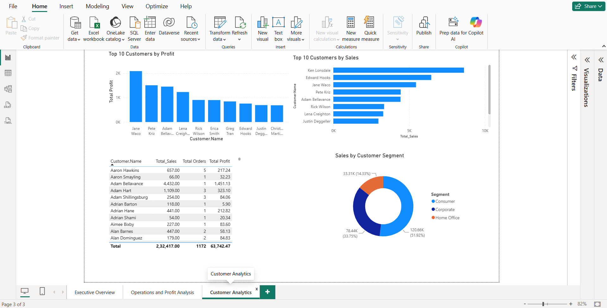

# Sales Analytics Dashboard

## Project Overview

This project presents an interactive Sales Analytics Dashboard developed using Power BI. The dashboard provides insights into sales performance, profitability, customer behavior, shipping efficiency, and operational trends.

## Technologies Used

- Power BI
- Power Query
- DAX
- Excel

## Dashboard Features

### Executive Overview
- Total Sales
- Total Profit
- Total Orders
- Total Quantity Sold
- Average Delivery Days
- Profit Margin %

### Operations & Profit Analysis
- Profit Band Distribution
- Sales Band Distribution
- Shipping Performance Analysis
- Delivery Days Analysis
- Profit Margin Analysis

### Customer Analytics
- Top 10 Customers by Sales
- Top 10 Customers by Profit
- Customer Segment Analysis
- Customer Contribution Insights

## Data Transformations

Performed using Power Query:

- Delivery Days Calculation
- Profit Margin Calculation
- Profit Band Categorization
- Sales Band Categorization
- Shipping Performance Classification
- Weekend vs Weekday Order Analysis

## DAX Measures

- Total Sales
- Total Profit
- Total Orders
- Total Quantity
- Profit Margin %
- Average Delivery Days

## Dashboard Screenshots

### Executive Overview

### Operations & Profit Analysis

### Customer Analytics

## Business Insights

The dashboard enables users to:

- Monitor sales performance over time
- Analyze customer purchasing behavior
- Evaluate shipping efficiency
- Identify high-performing customers
- Support data-driven business decisions
